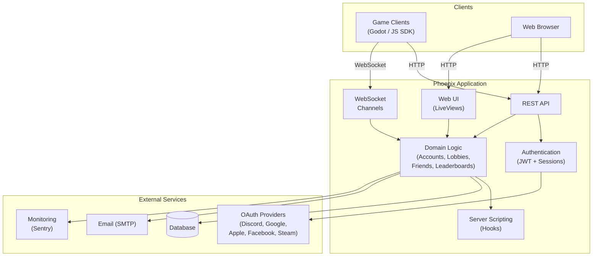
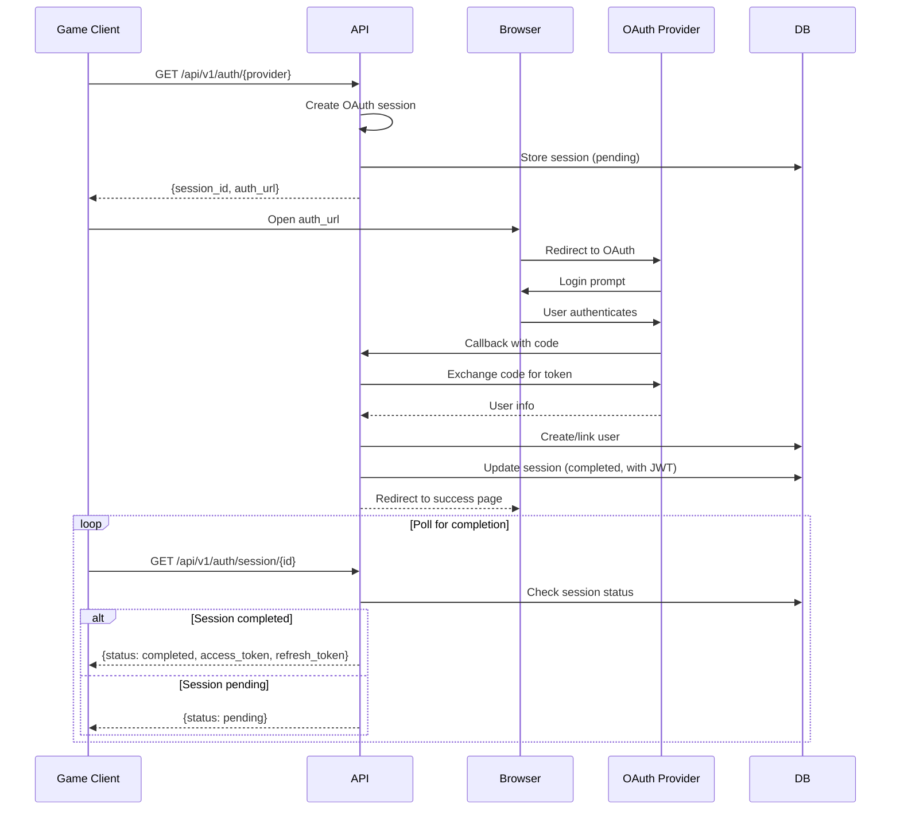
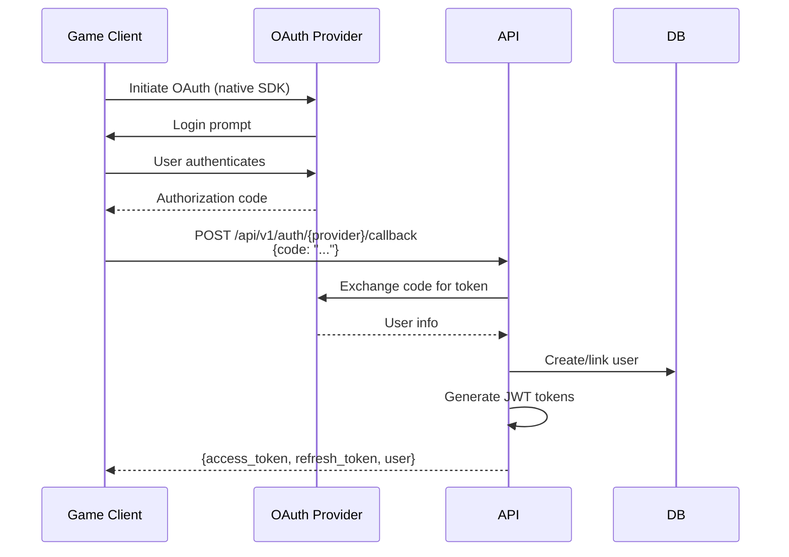
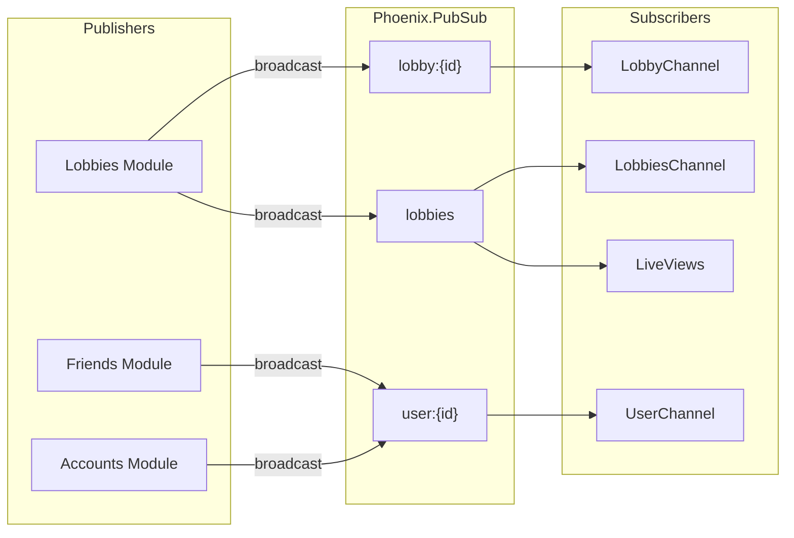
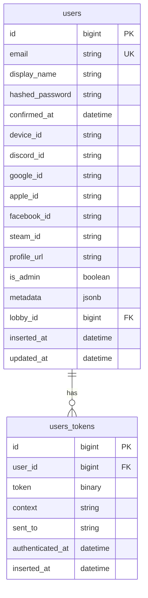
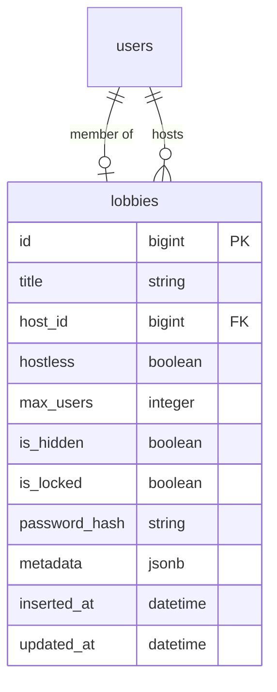
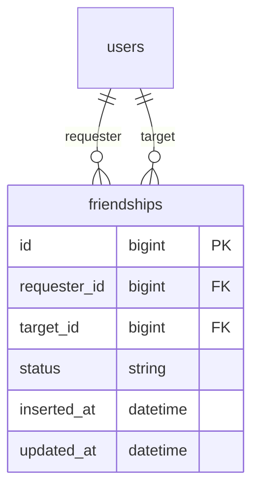
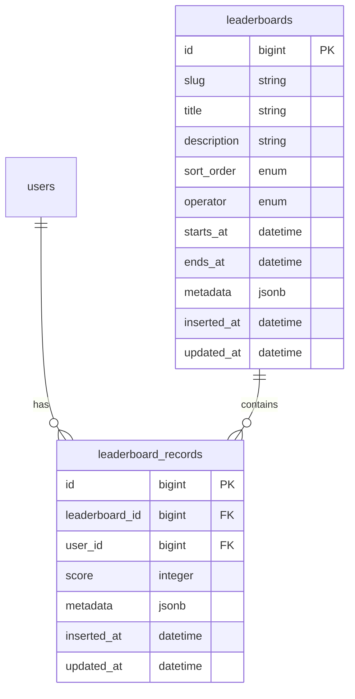
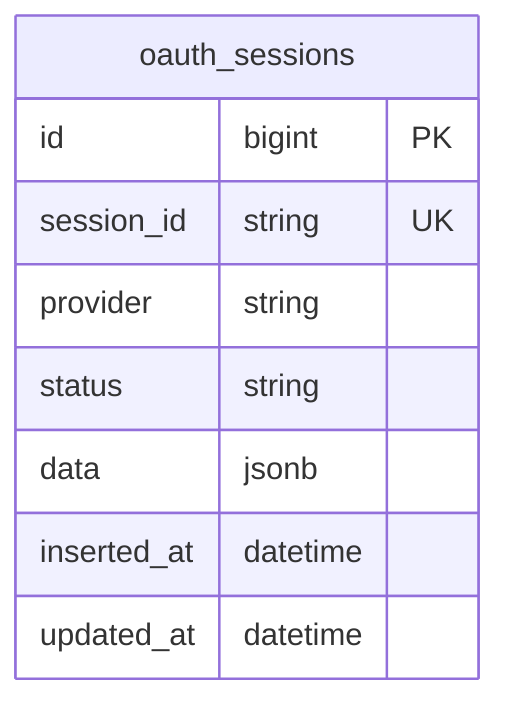

# Architecture

This document provides an overview of the GameServer (Gamend) architecture.

## 1. High-Level Overview

The system follows a typical Phoenix application structure with game clients (Godot/JavaScript SDKs) and web browsers connecting to the server. The Phoenix application exposes a REST API for game operations, a WebSocket layer for real-time updates, and a LiveView-based admin UI. All requests flow through authentication before reaching the domain logic, which interacts with external services like the database, OAuth providers, and monitoring.



## 2. Authentication

The application supports multiple authentication methods, all returning JWT tokens for API access.

### 2.1 Email/Password & Device Token Authentication

For traditional email/password login or anonymous device-based authentication. The API uses JWT-based authentication with short-lived access tokens (15 min) and long-lived refresh tokens (30 days). Subsequent requests include the access token in the Authorization header. When access tokens expire, clients use the refresh token to obtain new credentials without re-authenticating.

```mermaid
sequenceDiagram
    participant Client
    participant API
    participant Guardian
    participant Accounts
    participant DB

    rect rgb(20, 23, 20)
        Note over Client,DB: Login Flow (Email/Password or Device Token)
        Client->>API: POST /api/v1/login<br/>or POST /api/v1/login/device
        API->>Accounts: get_user_by_email_and_password<br/>or find_or_create_device_user
        Accounts->>DB: Query/Create user
        DB-->>Accounts: User
        Accounts-->>API: User
        API->>Guardian: encode_and_sign(user)
        Guardian-->>API: {access_token, refresh_token}
        API-->>Client: {access_token, refresh_token}
    end

    rect rgb(20, 20, 23)
        Note over Client,DB: Authenticated Request
        Client->>API: GET /api/v1/me<br/>Authorization: Bearer {token}
        API->>Guardian: verify_token
        Guardian-->>API: User claims
        API->>Accounts: get_user
        Accounts->>DB: Query
        DB-->>Accounts: User
        Accounts-->>API: User
        API-->>Client: User data
    end

    rect rgb(23, 20, 20)
        Note over Client,DB: Token Refresh
        Client->>API: POST /api/v1/refresh<br/>{refresh_token}
        API->>Guardian: exchange(refresh_token)
        Guardian-->>API: {new_access_token, new_refresh_token}
        API-->>Client: {access_token, refresh_token}
    end
```



### 2.2 OAuth with Browser Redirect (Authorization Code Flow)

For OAuth authentication (Discord, Google, Apple, Facebook, Steam) when the game client cannot handle OAuth natively. The client requests an auth URL and session ID from the API, then opens the URL in a browser where the user authenticates with the provider. The browser redirects back to the server which stores the result. Meanwhile, the game client polls the session endpoint until completion, then receives its JWT tokens.



### 2.3 OAuth with Direct Code Exchange

For clients that handle the OAuth flow themselves (e.g., native mobile apps using platform SDKs). The client obtains the authorization code from the provider using native SDKs, then POSTs it to the API callback endpoint to receive JWT tokens immediately—no browser or polling required.



This flow is simpler since there's no browser redirect or polling. It's ideal for:
- Native mobile apps using Google Sign-In, Apple Sign-In, or Facebook SDK
- Steam authentication using auth tickets

## 3. Real-time Updates (PubSub)

Real-time features use Phoenix PubSub for broadcasting events. Domain modules (Lobbies, Friends, Accounts) publish to topic-based channels. WebSocket channels and LiveViews subscribe to relevant topics to receive instant updates. This enables features like live lobby member lists or friend request notifications.



## 4. Hooks System

The hooks system provides server-side scripting capabilities. Elixir modules placed in the `modules/` directory are watched and compiled at runtime. These modules implement lifecycle callbacks (e.g., `after_user_register`, `before_lobby_create`) that are invoked automatically. Hooks can also expose custom RPC functions callable via the API, enabling game-specific server logic without modifying the core codebase.

## 5. Database Schema

The database schema supports the core features: users with authentication tokens and OAuth provider IDs, lobbies with membership tracking, friendships with request states, leaderboards with score records, and OAuth sessions for tracking authentication flows. Users can belong to one lobby at a time (via `lobby_id`), and all entities support JSON metadata for extensibility.

### 5.1 Users

User accounts with multiple authentication methods and profile data.

**Features:**
- **Email/Password authentication** - Traditional registration with hashed passwords and email confirmation
- **Device tokens** - Anonymous authentication via unique device identifiers
- **OAuth linking/unlinking** - Link multiple providers (Discord, Google, Apple, Facebook, Steam) to a single account; unlink providers while keeping the account
- **Profile management** - Display name, profile URL (avatar from OAuth), and arbitrary metadata JSON
- **Admin flag** - Elevated privileges for admin dashboard access
- **Real-time updates** - User changes broadcast via PubSub to connected clients



### 5.2 Lobbies

Game rooms for matchmaking and multiplayer sessions.

**Features:**
- **Host management** - One user hosts the lobby with elevated permissions (kick, update settings)
- **Hostless mode** - Server-managed lobbies without a dedicated host
- **Capacity limits** - Configurable max users (1-128)
- **Visibility** - Hidden lobbies excluded from public listings
- **Locking** - Locked lobbies prevent new joins; optional password protection
- **Membership tracking** - Users belong to one lobby at a time via `lobby_id` foreign key
- **Real-time updates** - Lobby changes broadcast to all members and lobby list subscribers
- **Metadata** - Arbitrary JSON for game-specific settings (map, mode, etc.)



### 5.3 Friends

Social connections between users with request workflow.

**Features:**
- **Friend requests** - Send, accept, or reject friend requests
- **Blocking** - Block users to prevent further interaction
- **Bidirectional queries** - Find friends regardless of who initiated the request
- **Status tracking** - `pending`, `accepted`, `rejected`, `blocked` states
- **Real-time notifications** - Friend events broadcast to user channels



### 5.4 Leaderboards

Competitive scoreboards with seasonal support and multiple scoring modes.

**Features:**
- **Seasons via slugs** - Reuse the same `slug` (e.g., "weekly_kills") across multiple leaderboard instances; query by slug for the currently active one, or by ID for a specific season
- **Time-limited** - Optional `starts_at` and `ends_at` for seasonal/event leaderboards
- **Sort orders:**
  - `desc` - Higher scores rank first (default, e.g., points)
  - `asc` - Lower scores rank first (e.g., fastest time)
- **Score operators (4 types):**
  - `set` - Always replace with new score
  - `best` - Only update if new score is better (default)
  - `incr` - Add to existing score (cumulative)
  - `decr` - Subtract from existing score
- **Pagination** - Efficient ranked queries with cursor-based pagination
- **User records** - Get a user's score and rank, or scores around their position
- **Metadata** - Arbitrary JSON per leaderboard and per record



### 5.5 OAuth Sessions

Temporary sessions for OAuth polling flows used by game clients.

**Features:**
- **Session polling** - Game clients poll for OAuth completion status
- **Multi-provider** - Supports all OAuth providers (Discord, Google, Apple, Facebook, Steam)
- **Status tracking** - `pending`, `completed`, `error`, `conflict` states
- **Data storage** - Stores tokens, user info, and error details for debugging



## 6. Directory Structure

The codebase follows Phoenix conventions with a clear separation between domain logic (`lib/game_server/`) and web layer (`lib/game_server_web/`). Client SDKs are maintained in `clients/`, runtime hook scripts go in `modules/`, and the Elixir SDK stubs for IDE support live in `sdk/`.

```
game_server/
├── lib/
│   ├── game_server/           # Domain logic
│   │   ├── accounts/          # User management
│   │   ├── friends/           # Friend system
│   │   ├── hooks/             # Server scripting
│   │   ├── leaderboards/      # Leaderboard system
│   │   ├── lobbies/           # Lobby management
│   │   ├── oauth/             # OAuth helpers
│   │   ├── schedule/          # Cron-like scheduling
│   │   └── theme/             # UI theming
│   │
│   ├── game_server_web/       # Web layer
│   │   ├── auth/              # Guardian pipeline
│   │   ├── channels/          # WebSocket channels
│   │   ├── components/        # UI components
│   │   ├── controllers/       # HTTP controllers
│   │   │   └── api/v1/        # REST API v1
│   │   ├── live/              # LiveView modules
│   │   │   └── admin_live/    # Admin dashboard
│   │   ├── on_mount/          # LiveView hooks
│   │   └── plugs/             # Custom plugs
│   │
│   └── mix/                   # Mix tasks
│       └── tasks/             # Custom tasks (gen.sdk)
│
├── modules/                   # Runtime hooks (user scripts)
├── assets/                    # Frontend assets
├── clients/                   # Client SDKs
│   ├── godot/                 # Godot SDK
│   └── javascript/            # JavaScript SDK
├── sdk/                       # Elixir SDK stubs
├── config/                    # Configuration
├── priv/                      # Static assets & migrations
└── test/                      # Tests
```

## 7. Key Technologies

The stack is built on Elixir/Phoenix for high concurrency and fault tolerance. SQLite is used for simple deployments with PostgreSQL supported for production scale. Guardian handles JWT authentication while Ueberauth manages OAuth flows. Quantum provides cron-like job scheduling for recurring tasks.

| Component | Technology |
|-----------|------------|
| Framework | Phoenix 1.8 |
| Language | Elixir 1.19 |
| Database | SQLite3 / PostgreSQL |
| Real-time | Phoenix Channels, PubSub |
| Auth (JWT) | Guardian |
| Auth (OAuth) | Ueberauth |
| Scheduling | Quantum |
| CSS | Tailwind CSS 4 |
| Monitoring | Sentry, Telemetry |
