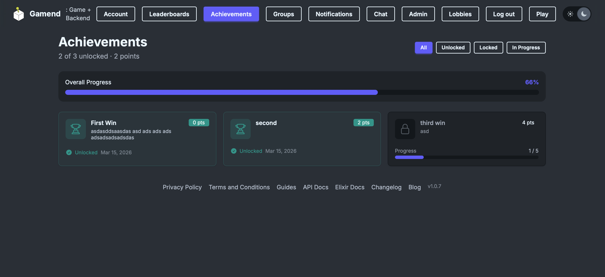
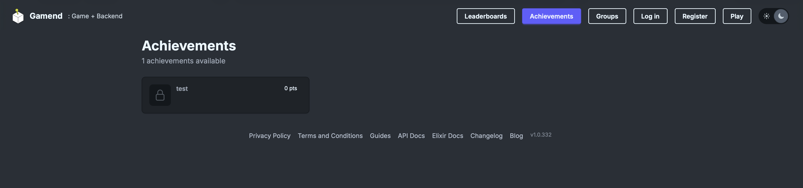
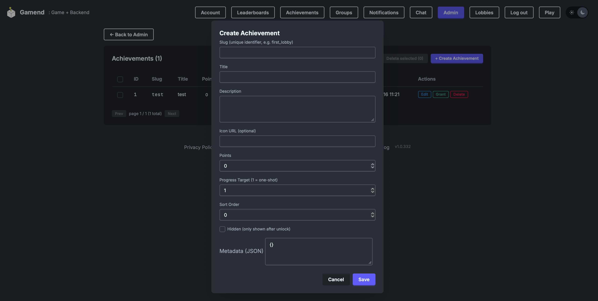

# Achievements

Was playing with adding achievements to gamend (with the thought of ultimately integrating them with steam achievements, apple and google achievements, maybe, but later).

They are also visible if you aren't logged in.

And there is an admin view where achievements can be created, and then they can be given/updated through server side API:

I will use this to add achievements to Polyglot Pirates (eg. if someone guesses 100 words correctly, to get an achievement)
