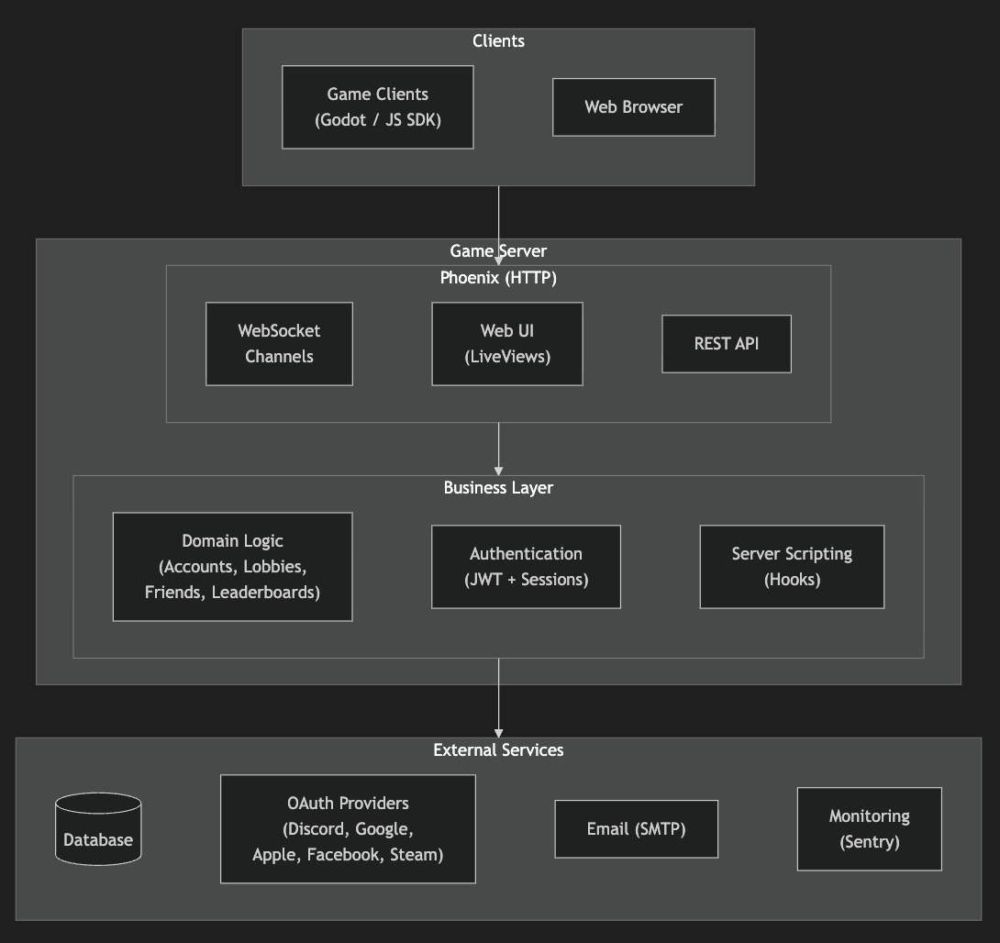
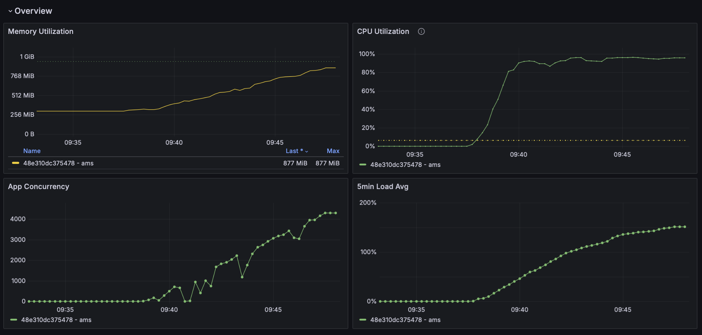
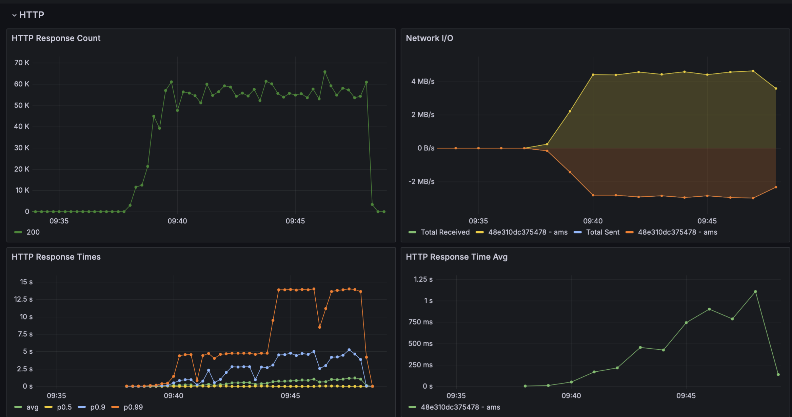
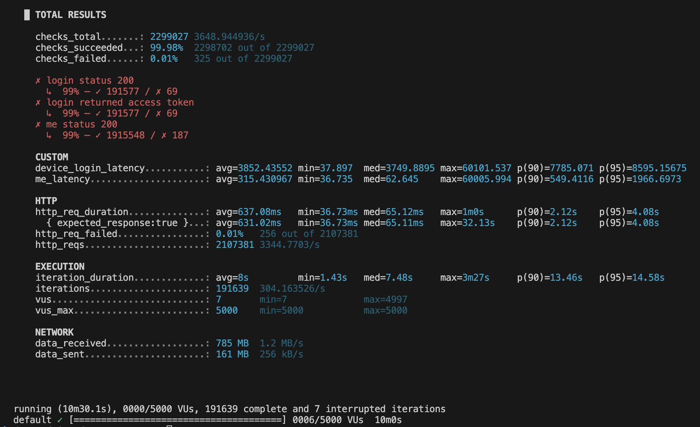

# Gamend - Game Server Stress Test

Ok so I started to **stress test** my game server (Using k6, a great server stress tool).

I wanted to see where are the limits of the system right now. In this article I will talk how I solved the issues with:
- **Out of Memory**
- **Database Timeouts**

I set the stress test to execute for 15 minutes 5000 **flows**, where each flow creates a new account (**db write**) and then reads 10 times the self user data (**db read**), sleeping 1s in between.

Throughout this whole test I saw what the current **bottlenecks** are and what I need to improve.

## Architecture

But first, the architecture. Clients call into:
- **HTTP Layer**, then
- **Business Layer**, then
- **Database Layer** (SQLite or PostgreSQL) or
- **External Services** (OAuth provider, Email Service, etc.).

## Out of Memory Problems

Immediately a lot of the calls errored out and hanged after few seconds. Looking at Graphana metrics (image below), I saw that the app went **Out of Memory** (the red dotted line).

The limits were set the lowest, as I was in development until now:
- **1 vCPU** and **256 MB** of ram (about 3$ per month).

So I increased to:
- **4 vCPU** and **1 GB** ram (8$ per month).

Now even at 1000 calls simultaneous (hardcoded limit for the app), it wasn't dying with Out of Memory anymore.

About the 1000 hard limit a bit, this limit ensures some of the 5000 flows will error, but this is by design, as I wanted to test this case also. I will increase it later (at caching part).

## Database Timeout Errors

Now that the crashes were out of the way, I got to a **77% success rate** on the test, which means only that many calls succeeded, rest failed (5xx errors). The requests were also low, at **1500 requests per second**:

I investigated a bit, and the issue was the **database writes and reads**. I have a queue for the database, and any database operation that waits for more than few seconds gets imediately cancelled and results in a 5xx error (this is to ensure queued calls don't cascade into errors one after another).

For context, as I try to minimise costs, I use **SQLite** (I only pay less than 1$ per month for the disk), but the server supports **PostgreSQL** also, which handles parallel writes and reads better.

## Caching and next steps

Next, I added **in memory caching** (with option to later add multi level caching with local + distributed) by integrating [Nebulex](https://github.com/elixir-nebulex/nebulex).

I ran again the stress test, but this time for 10 minutes, to test for reliability.

Now it was able to handle **4000 users concurrently**, utilizing all CPU and almost all RAM.

The number of requests served was at about **3000 per second**, however as users grew, so did the HTTP response time, with a p99 of 15s:

The total successful requests is at 99.98%, with a total of **2 mil requests over 10 min**,

