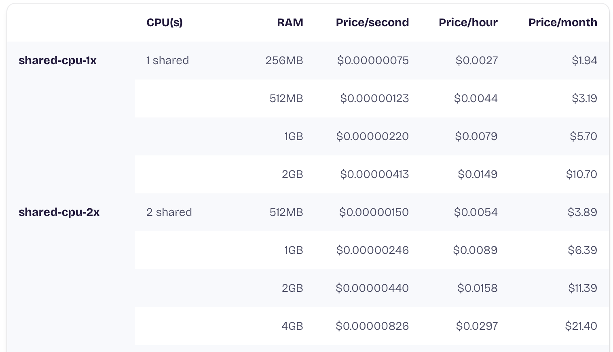
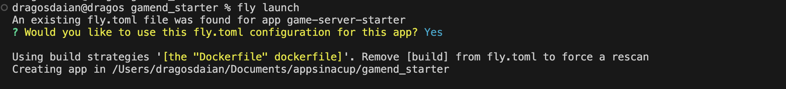
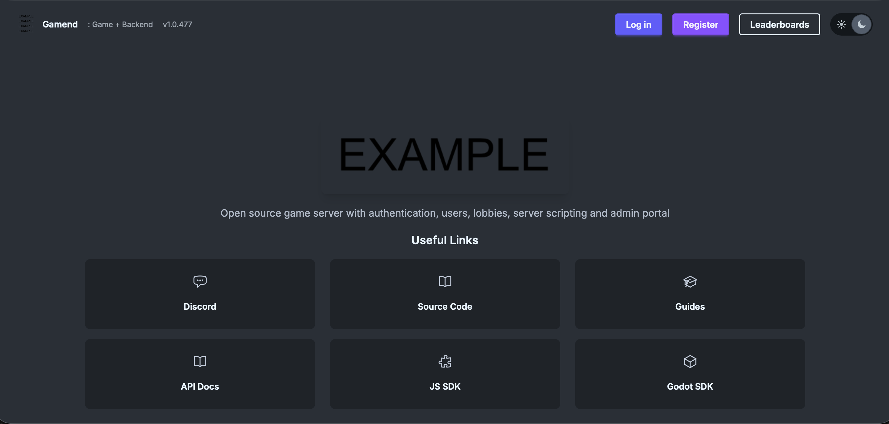
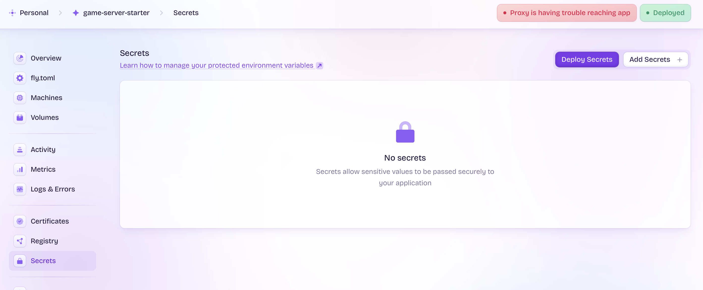

# Gamend - Game Server Deploy

This tutorial will help you to deploy Gamend.

I'm using [fly.io](https://fly.io). For this we are using a shared instance that will cost about **5$ per month** (shared-cpu-2x with 512MB) ([Fly.io pricing](https://fly.io/docs/about/pricing/)):

  

## Create an account
- Create an account on [fly.io](https://fly.io).
- Install locally [flyctl](https://fly.io/docs/flyctl/install/):
  ```sh
  # macOS
  brew install flyctl
  # Linux
  curl -L https://fly.io/install.sh | sh
  # Windows
  pwsh -Command "iwr https://fly.io/install.ps1 -useb | iex"
  ```

## Configure

- Clone/fork the [gamend_starter](https://github.com/appsinacup/gamend_starter) repo.
- Run in the repo the following command:
  ```sh
  fly deploy
  ```

## Deploy

- Select `y` on the re-use fly.io (first prompt), then press Enter on other questions:
  
- That's it, at the end you will be given a URL you can visit to see the app:
  
- Go to the URL and Register using Email (first account created will be Admin).
  

## Notes:

This starter uses **dev mode** and has nothing configured. If you want to do a real deployment, configure secrets in the fly.io Secrets tab (eg. OAuth, Email server, etc.)

  

Also, this is a simple deployment with 1 instance, SQLite and local caching. For more complex deployments, see the [Scaling article](https://appsinacup.com/gamend-scaling/).
