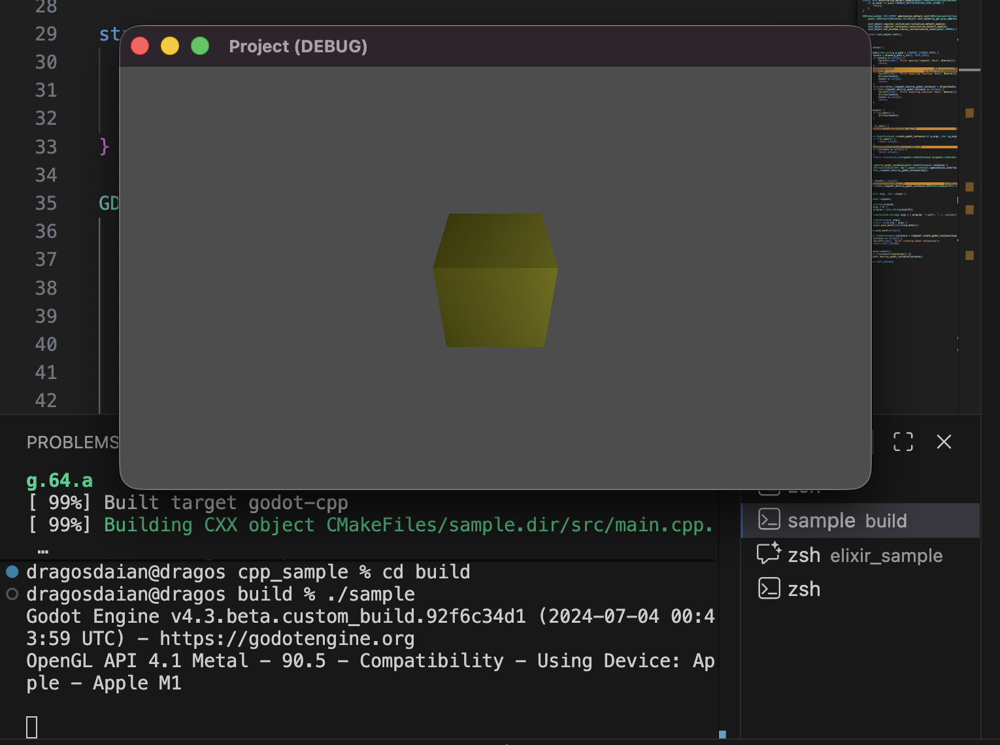
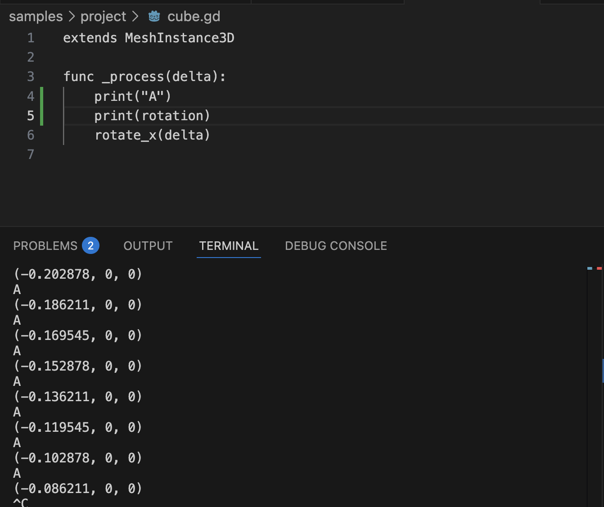
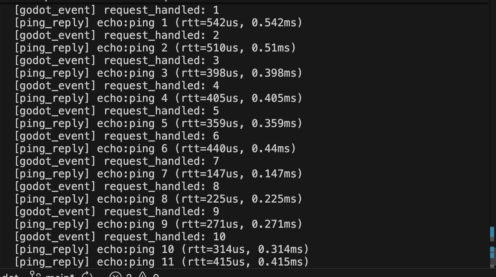

# Gamend - LibGodot Integration

Previously I had added integration with Godot from Gamend:
- Host (Elixir) -> Godot (WebSocket)

## The Problem

This was nice as a proof of concept, but in real life, it was **slow**:

|Time|Case|Language|
|-|-|-|
|0.1 - 0.5 ms|Simple Function| Elixir |
|0.5 - 1 ms|Complex Function| Elixir |
|1-10 ms|Simple Function| GDScript |
|~100 ms|Complex Function| GDScript |

The **Simple Function** is a HTTP call with Authentication, while the **Complex Function** one does also database access or cache access.

In **Godot** it is so slow because the communication layer is WebSocket, and whenever Godot calls back into Host, it does so with HTTP. For a simple case, it's just the WebSocket overhead:

```text
Gamend --WS-> Godot --WS-> Gamend
```

For a more complex case, it is both the WebSocket and the HTTP layer from Gamend:

```text
Gamend
| (Send input)
WS
v
Godot -HTTP-> Gamend (eg. create KV)
      -HTTP-> Gamend (eg. get KV)
| (Receive result)
WS
v
Gamend
```

The delay added from both WS (WebSocket) and HTTP (calling back into the server for Admin SDK) is too big to make it feasible.

## LibGodot

LibGodot is an [upcoming feature](https://godotengine.org/article/dev-snapshot-godot-4-6-dev-2/#build-godot-engine-as-a-library) of Godot where one can now build the engine as a shared library (or static), and then start the engine from within the host application.

Until that ships, I cloned locally [migeran/libgodot](https://github.com/migeran/libgodot) (which uses Godot 4.3 with some changes) and after some time of building both **godot** and **godot-cpp**, I built the cpp-sample and ran it:



```cpp
int main(int argc, char **argv) {
    LibGodot libgodot;

    godot::GodotInstance *instance = libgodot.create_godot_instance(argc, argv);

    instance->start();
    while (!instance->iteration()) {}
    libgodot.destroy_godot_instance(instance);
}
```

How it works? It starts godot and calls **iteration** as to move the engine **process** function forward.

## LibGodot in Gamend

I extended this functionality and sample to have a function for sending data **to Godot**, and one where Godot can send data back **to Elixir** (Gamend).

### About the main thread

Since Elixir runs it's application inside BEAM and that doesn't offer access to the **main thread** (and Godot really wants to run on the main thread), I ended up starting a thread and running there Godot. That means Godot won't be able to load menus (and possibly other stuff) that require main thread. This is fine for my use cases, as I run it **headless** anyway.

### Data Bus

As an initial API, I made a Data Bus for **sending and receiving data** from and to Elixir from Godot.

```js
extends MeshInstance3D

var bus

func _ready() -> void:
	bus = Engine.get_singleton("ElixirBus")
	if bus:
		bus.connect("new_message", Callable(self, "_on_new_message"))
		bus.send_event("status", "godot_ready")

func _on_new_message(_queued: int) -> void:
  for msg in bus.drain():
    bus.send_event("request_handled", msg)
    print("Elixir message: ", msg)
  
func _process(delta):
  print("A")
  print(rotation)
	rotate_x(delta)
```

## Conclusion

And it works:



And the time is much better than before, in order of 0.1 - 0.5 ms, closer to what Elixir was obtaining:


